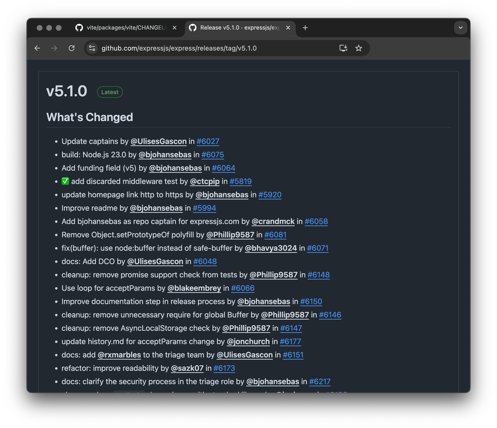
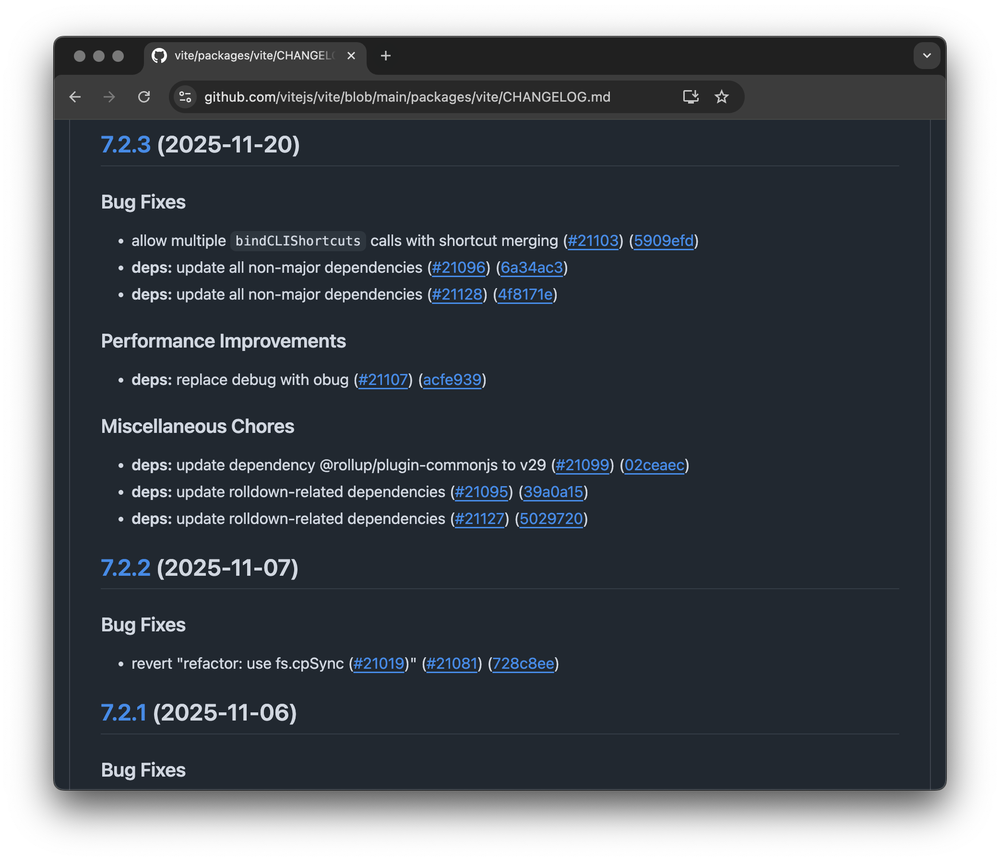
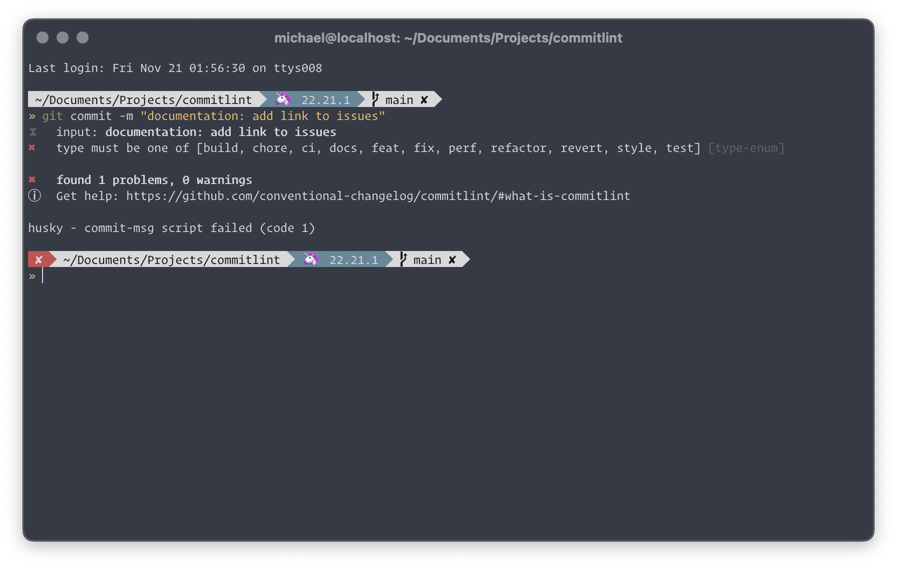

# The conventional eco system

#### *Changelogs aus Commit messages erstellen*

---

## Me

Michael Kühnel  
– Webmontag Orga –   
– Frontend Entwickler bei Teclion –  
(Finanzamt Kassel)  
– [michael-kuehnel.de](https://michael-kuehnel.de) –

---

## Das Problem



Note: 
- Hohe Relevanz für konsumierte Projekte: Libraries, Frameworks, APIs
- Vermutlich aus der git Historie erstellt
- Ohne Standards schwer nachzuvollziehen: Feature, Fix, Breaking Change?
- Manuelle Release Notes: fehleranfällig, zeitaufwändig

---

## Das Ziel



Note: 
- Automatisch generierte Changelogs
- Vollständig automatisierbarer Release-Prozess
- Sinnvoll gruppiert und ohne unnötigen noise

---

## Wie kommen wir da hin?

1. Semantic Versioning – Strukturierte Versionsnummern <!-- .element: class="fragment" -->
2. Conventional Commits – Standardisierte Commit Messages<!-- .element: class="fragment" -->
3. Automatisierung – Tools für den Release-Prozess <!-- .element: class="fragment" -->
4. Linting – Sicherstellung der Konventionen <!-- .element: class="fragment" -->

Note: 
- Vier Bedingungen für robusten, automatisierten Release-Prozess
- Jeder Aspekt wird im Detail betrachtet

---

## Semantic Versioning

<span>BREAKING</span><!-- .element: class="fragment" --><span>.FEATURE</span><!-- .element: class="fragment" --><span>.BUGFIX</span><!-- .element: class="fragment" -->

Note: An Versionsummer erkennbar:
- Was beinhaltet das Release

--

## v4.12.32 <span>➡️  v4.12.33</span><!-- .element: class="fragment" -->

```
                ┌───────┬───────┬───────┐
                │   4   │   12  │   33  │
                └───┬───┴───┬───┴───┬───┘
                    │       │       │
                  MAJOR   MINOR   PATCH
                    │       │       │
                Breaking   Neue    Bug-
                 Changes Features fixes
```
<!-- .element: class="fragment" -->

--

## Pre-Release labels

Pre-Release Versionen:
- `v1.0.0-alpha.1`
- `v1.0.0-beta.3`
- `v1.0.0-rc.1`

--

### Warum und für wen?

- APIs
- Libraries & Frameworks
- Component Libraries

Konsumenten können auf einen Blick erkennen, ob ein Update Breaking Changes enthält.<!-- .element: class="fragment" -->

```
"dependencies": {
  "foo": "~5.1.0"
  "bar": "^1.30.0"
}
```
<!-- .element: class="fragment" -->


Note: 
- Wichtig sichere Dependency-Verwaltung
- Tools wie npm können automatisch sichere Updates bestimmen
  - `^1.2.3` erlaubt Minor + Patch (>=1.2.3, <2.0.0) - keine Breaking Changes
  - `~1.2.3` erlaubt nur Patch (>=1.2.3, <1.3.0)

---

## Conventional Commits

--

### Beispiele für Commit Types

```txt
feat: add user authentication
^     ^
|     |
type  subject (Beschreibung)
```

```
- fix: resolve memory leak in data processing
- docs: update API documentation
- ci: cache dependencies
- test(my-component): Increase coverage
- feat(lang): add Polish language
```
<!-- .element: class="fragment" -->

Note: 
- Weitere Types: docs, style, refactor, test, chore, ci
- Subject: kurz und prägnant
- Scope optional 

--

### Commit Message Struktur

```xml
<type>(<scope>): <subject>

<body>

<footer>
```

**Beispiel:**
```bash
feat(auth): add OAuth2 login support

Implement OAuth2 authentication flow with Google
and GitHub providers. Includes token refresh logic
and session management.

Closes #123
```

Note: 
- Body: detaillierte Informationen
- Footer: Metadaten wie Issue-Referenzen oder andere Links

--

### Breaking Changes

```
feat!: redesign API response format

BREAKING CHANGE: API responses now use camelCase
instead of snake_case for property names.

Migration guide: https://docs.example.com/v2
```

Note: 
- Besonders wichtig für Konsumenten
- Zwei Markierungs-Arten: `feat!` oder `BREAKING CHANGE:` im Footer
- Sollten prominent in Release Notes erscheinen
- GGf. Migration Guide bereitstellen

---

## Strkturierte Changelogs


```markdown
## [2.0.0] - 2025-11-20

### BREAKING CHANGES
- remove deprecated v1 API endpoints (#127)

### Features
- add user authentication (#123)
- implement dark mode toggle (#125)

### Bug Fixes
- resolve memory leak in data processing (#124)
- fix broken links in documentation (#126)

```

Note: 
- Commits gruppiert nach Type
- Features, Fixes, Breaking Changes separat gelistet
- Issue-/PR-Referenzen automatisch verlinkt
- Deutlich übersichtlicher und konsistenter
- Überlegung: Welche Types will man hier sehen

---

## Demo I

#### commit-and-tag-version

[github.com/absolute-version/commit-and-tag-version](https://github.com/absolute-version/commit-and-tag-version)

--

**package.json:**
```json
{
  "name": "demo-commit-and-tag-version",
  "version": "0.0.0",
  "private": true,
  "scripts": {
    "release": "commit-and-tag-version",
    "release:patch": "commit-and-tag-version --release-as patch",
    "release:minor": "commit-and-tag-version --release-as minor",
    "release:major": "commit-and-tag-version --release-as major",
    "release:dry": "commit-and-tag-version --dry-run"
  },
  "devDependencies": {
    "commit-and-tag-version": "^12.6.0"
  }
}
```

Note: 
- Minimales Setup: nur Dependency + Scripts in package.json
- Verschiedene release-Scripts ermöglichen manuelle Overrides

--

## Was haben wir gelernt?

<div>

- ✅ Einfaches Setup (2 Minuten)
- ✅ Deterministisch und schnell
- ✅ Zuverlässige Conventional Commits Analyse
- ✅ Perfekt für CI/CD
</div><!-- .element: class="fragment" -->

--

### Aber

- ⚠️ Beschränktes Feature Set
- ⚠️ Git push muss manuell erfolgen
- ⚠️ Kein npm publish
- ⚠️ Keine GitHub/GitLab Releases

Note: 
- Macht genau eine Sache sehr gut: Version bumpen, CHANGELOG generieren, Git Tag erstellen
- Für kompletten Release-Prozess: weitere Scripts zusammenbauen
- Nicht unbedingt Nachteil - oft will man genau diese Kontrolle

---

## Demo II: release-it

[github.com/release-it/release-it](https://github.com/release-it/release-it)

--

**package.json:**
```json
{
  "name": "demo-release-it",
  "version": "0.0.0",
  "private": true,
  "scripts": {
    "release": "release-it",
    "release:dry": "release-it --dry-run",
    "release:ci": "release-it --ci"
  },
  "devDependencies": {
    "release-it": "^17.10.0",
    "@release-it/conventional-changelog": "^8.0.2"
  }
}
```

Note: 
- Interaktive Komplettlösung
- Benötigt Plugin für Conventional Commits Support
- Config in package.json, .release-it.json oder eigener Config-Datei
- `--ci` Flag macht es vollständig automatisch für CI/CD

--

## Was haben wir gelernt?

<div>

- ✅ Interaktive Prompts (User-friendly)
- ✅ Flexible Komplettlösung
- ✅ Plugin Ecosystem (z.B. npm, GitHub, GitLab)
- ✅ Lifecycle Hooks für Custom Logic
- ✅ Changelog Preview vor Release
</div><!-- .element: class="fragment" -->


--

### Aber
- ⚠️ Mehr Komplexität
- ⚠️ Mehr Dependencies
- ⚠️ Setup dauert länger

Note: 
- Glänzt durch Flexibilität
- Interaktive Prompts geben Kontrolle bei jedem Schritt
- Plugin-System: Integration mit fast allem
- Hooks erlauben Custom Logic (Tests, Build, Deploy)
- Schweizer Armee-Messer-Lösung

---

## Vergleich

| Aspekt | commit-and-tag-version | release-it |
|--------|------------------------|------------|
| **Setup-Zeit** | 2 Minuten | 5-10 Minuten |
| **Lernkurve** | Sehr flach | Mittel |
| **Kontrolle** | Explizite Scripts | Interaktive Prompts |
| **Fehler-Prävention** | Manual review | Step-by-step confirmation |
| **CI/CD Ready** | ✅ by default | ✅ Mit --ci Flag |
| **GitHub/GitLab releases** | ❌ Manuell | ✅ Automatisch |
| **npm publish** | ❌ Separater Schritt | ✅ Integriert |
| **Preview** | --dry-run Flag | Changelog Preview + dry-run |

Note: 
- Wahl hängt vom Use Case ab
- commit-and-tag-version: Simple Setups, maximale Kontrolle
- release-it: Full-Featured Releases, weniger manueller Aufwand
- Beide ausgereifte, gut dokumentierte Tools

---

## Potentielles Problem

Funktioniert nur, wenn Conventional Commits eingehalten werden!

--

- Typos passieren
  - (`feat` vs `feature`)
- Vergessene Doppelpunkte
  - (`docs add mySpace link`)
- Falsche Types
  - (`update: …` statt `feat: …`)

Note: 
- unabhängig vom Tool
- Selbst in engagierten Teams passieren Fehler
- Ein nicht-konformer Commit kann automatischen Release-Prozess stören

--

### **Lösung:** Linting mit commitlint




- Lösung: Automation durch Linting (ähnlich wie ESLint für Code)

---

## Demo III: commitlint

--

### GitHub: commitlint

[github.com/conventional-changelog/commitlint](https://github.com/conventional-changelog/commitlint)

**package.json:**
```json
{
  "name": "demo-commitlint",
  "version": "0.0.0",
  "private": true,
  "description": "Demo for commitlint with Husky git hooks to enforce conventional commits",
  "type": "module",
  "main": "index.js",
  "scripts": {
    "prepare": "husky",
    "test:valid": "echo 'feat: add new feature' | commitlint",
    "test:invalid": "echo 'invalid commit message' | commitlint || echo 'Commit message rejected as expected'"
  },
  "devDependencies": {
    "@commitlint/cli": "^19.6.0",
    "@commitlint/config-conventional": "^19.6.0",
    "husky": "^9.1.7"
  }
}
```

Note: 
- Typischerweise mit Husky als Git Hook installiert
- commit-msg Hook validiert jede Commit Message vor Commit
- @commitlint/config-conventional: Standard-Regeln für Conventional Commits

--

### Learnings: commitlint

**Gut:**
- ✅ Valide Changelogs garantiert
- ✅ Sofortiges Feedback bei Fehlern
- ✅ Anpassbare Regeln
- ✅ Shareable Configs für Team-Standards
- ✅ Integration mit CI/CD möglich


Note: 
- "Türsteher" für Commit Messages
- Verhindert ungültige Commits vor Historie-Eintrag
- Regeln vollständig konfigurierbar (lockerer oder strenger)
- Shareable Configs: konsistente Standards über mehrere Projekte

--

**Aber:**
- ⚠️ Kann (anfangs) nerven durch Strenge
- ⚠️ Erfordert Team commitment
- ⚠️ Git Hooks können umgangen werden (--no-verify)

---

## Alternative: semantic-release

**GitHub:** [github.com/semantic-release/semantic-release](https://github.com/semantic-release/semantic-release)

--

**Philosophy:** CI/CD-first, vollständig automatisiert

**Charakteristik:**
- ✅ Komplett automatischer Release bei jedem Push
- ✅ Keine manuelle Intervention nötig
- ✅ Für High-Volume Releases optimiert

Note: 
- Andere Philosophie: Zero human interaction
- Jeder Push zum Release Branch triggert automatisch Release
- Ideal für NPM-Packages mit ständigen neuen Versionen

--

- ⚠️ Komplexes Setup (~30 Minuten)
- ⚠️ Weniger Kontrolle (by design)

**Use Case:** Production CI/CD Pipelines mit frequent releases

Note: 
- Für traditionelle Release-Prozesse mit Reviews/QA: evtl. zu automatisch

---

## Vergleich: Alle drei Tools

| Feature | release-it | commit-and-tag-version | semantic-release |
|---------|-----------|------------------------|------------------|
| **Interactive prompts** | ✅ Excellent | ❌ None | ❌ None |
| **Auto-detect from commits** | ✅ With plugin | ✅ Built-in | ✅ Built-in |
| **Manual override** | ✅ Easy | ✅ CLI flags | ❌ Philosophy |
| **Version bumping** | ✅ Yes | ✅ Yes | ✅ Yes |
| **Changelog generation** | ✅ Plugin | ✅ Built-in | ✅ Plugin |
| **Git commit + tag** | ✅ Yes | ✅ Yes | ✅ Yes |
| **Git push** | ✅ Yes | ❌ Manual | ✅ Yes |
| **npm publish** | ✅ Yes | ❌ Manual | ✅ Yes |
| **GitHub releases** | ✅ Yes | ❌ No | ✅ Yes |
| **GitLab releases** | ✅ Yes | ❌ No | ✅ Yes |

---

## Vergleich: Maintenance & Adoption

| Feature | release-it | commit-and-tag-version | semantic-release |
|---------|-----------|------------------------|------------------|
| **CI/CD mode** | ✅ via CLI flag | ✅ Default behavior | ✅ Primary mode |
| **Setup time** | ~15 min | ~5 min | ~30 min |
| **Documentation** | ⭐⭐⭐⭐⭐ | ⭐⭐⭐⭐ | ⭐⭐⭐⭐⭐ |
| **Maintenance** | ✅ Active (v19.0.6) | ✅ Active (v12.6.0) | ✅ Active (v25.0.2) |
| **Last commit** | Nov 15, 2025 | Nov 3, 2025 | Nov 14, 2025 |
| **Last release** | Nov 15, 2025 | Nov 3, 2025 | Nov 14, 2025 |
| **Open issues** | 2 | 9 | 80 |
| **Last closed issue** | Nov 18, 2025 | Oct 30, 2025 | Nov 17, 2025 |
| **Open PRs** | 2 | 1 | 36 |
| **Last merged PR** | Nov 15, 2025 | Nov 3, 2025 | Nov 17, 2025 |
| **Weekly downloads** | 720k | 605k | 1.89M |
| **GitHub stars** | 8.7k | 556 | 22.9k |

Note: 
- Alle drei aktiv maintained und production-ready
- semantic-release führt bei Downloads/Stars, hat aber meiste offene Issues (größere Community)
- commit-and-tag-version: wenigste offene Issues (kleinerer Scope)
- release-it: Mitte, exzellente Docs

---

## Vollständigkeitshalber: Changesets

**GitHub:** [github.com/changesets/changesets](https://github.com/changesets/changesets)

**Use Case:** Monorepos mit unabhängigem Package Versioning

--

**Anderer Ansatz:**
- Contributors erstellen Changeset-Files
- Interaktiver CLI
- Changeset beschreibt Änderungen und Bump-Type
- Perfekt für Monorepos
<br><br>

**Verwendet von:**  
React, Vue, Svelte, vielen anderen großen Monorepos

Note: 
- Völlig anderer Ansatz: Contributors erstellen explizite Changeset-Dateien (nicht Commit Messages parsen)
- Ideal für Monorepos: ein Commit kann mehrere Packages betreffen
- Changeset CLI fragt interaktiv: welche Packages betroffen, welcher Bump-Type
- Verwendet von: React, Vue, Svelte, viele große Monorepos

---

## Wrap-up

--

### Zusammenfassung

**Conventional Commits = Grundlage**
- Strukturierte, lesbare Commit Historie
- Automatisierte Versionierung möglich

--

**Tools = Automatisierung**
- commit-and-tag-version: Einfach, deterministisch
- release-it: Interaktiv, feature-reich
- semantic-release: Vollautomatisch, CI/CD-first
- commitlint: Qualitätssicherung

--

**Start small, iterate**
- Alles ist besser als manuell und fehleranfällig
- Mit commitlint anfangen → dann Release Tool hinzufügen

Note: 
- Einblick ins Ökosystem (es gibt noch mehr)
- Schlüssel: überhaupt starten
- Selbst nur Conventional Commits ohne Tools besser als Chaos
- Commitlint in 5 Minuten hinzufügen
- Release-Tool später ergänzen
- Schrittweise Verbesserung

--

### Resources

**Demo & Slides:**
[github.com/mischah/conventional-changelog](https://github.com/mischah/conventional-changelog)

--

**Standards:**
- Conventional Commits: [conventionalcommits.org](https://conventionalcommits.org)
- Semantic Versioning: [semver.org](https://semver.org)

--

**Tools:**
- [github.com/absolute-version/commit-and-tag-version](https://github.com/absolute-version/commit-and-tag-version)
- [github.com/release-it/release-it](https://github.com/release-it/release-it)
- [github.com/semantic-release/semantic-release](https://github.com/semantic-release/semantic-release)
- [github.com/conventional-changelog/commitlint](https://github.com/conventional-changelog/commitlint)
- [github.com/changesets/changesets](https://github.com/changesets/changesets)

---

## Fragen?

Webmontag Chat:  
https://matrix.to/#/#webmontag-kassel:matrix.org

Weitere Kontaktmöglichkeiten:  
https://michael-kuehnel.de
